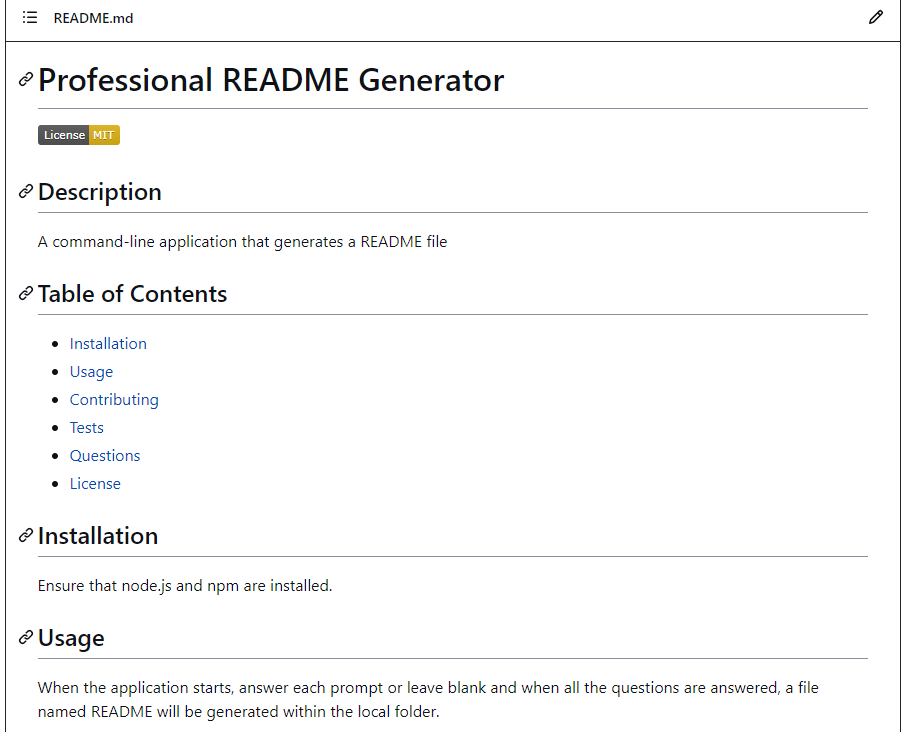
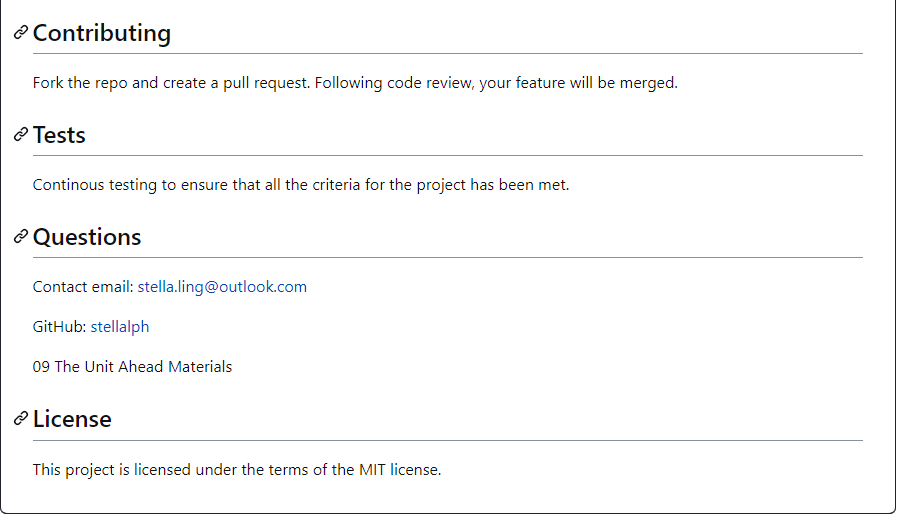

# Professional README Generator

## Description
A command-line application that generates a README file.

## Table of Contents
* [Installation](#installation)
* [Usage](#usage)
* [Contributing](#contributing)
* [Tests](#tests)
* [Questions](#questions)
* [License](#license)

## Installation
Ensure that node.js and npm are installed. 

 
## Usage
When the application starts, answer each prompt or leave blank and when all the questions are answered, a file named README will be generated within the local folder.

## Contributing
To contribute to this application, create a pull request.  Following a code review, your feature will be merged.

## Tests
Continous testing to ensure that all the criteria for the project has been met.

## Questions

Contact email: stella.ling@outlook.com

GitHub: [stellalph](https://github.com/stellalph)

The Unit Ahead Materials 09
git 
## License
  
This project is licensed under the terms of the MIT license.
  * For more information on license type and additional licensing information - https://choosealicense.com
    as per GitHub documentation.

## Description 
A command-line application that generates a professional README file from the user's input using the Inquirer package. A command-line application will allow for a quick and easy generation of a project README to get started quickly.  This will allow a project creator to spend more time working on finishing the project and less time creating a good README. 

## Installation
Ensure that node.js and npm are installed. The steps to use this appllication:-

  1. Fork the repository
  2. Run npm init
  3. Run npm i inquirer
  4. Run node.index.js
  

The sample README generated using the application before adding more comments to the README:-

The link to the video to show the walkthrough of the user 's input to generate README file.

[VIDEO](https://drive.google.com/file/d/1HK2mjneCTrPFAZN4J7GM6ry538QvUsMv/view)

[URL GitHub repository](https://github.com/stellalph/README-GENERATOR.git)

 The steps taken to achieve this:-

  * Fork the repo
  * Create a feature branch 
  * Commit your new feature
  * Push your branch (git push)
  * Create a new pull request